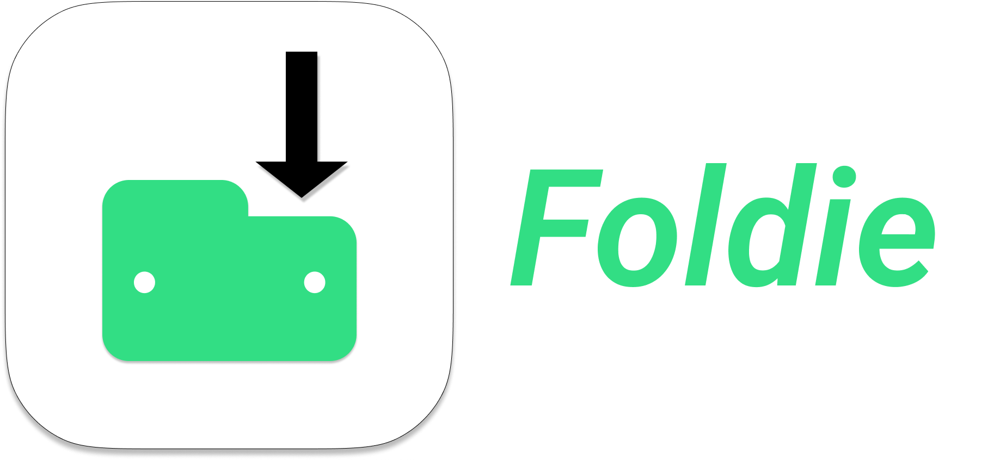
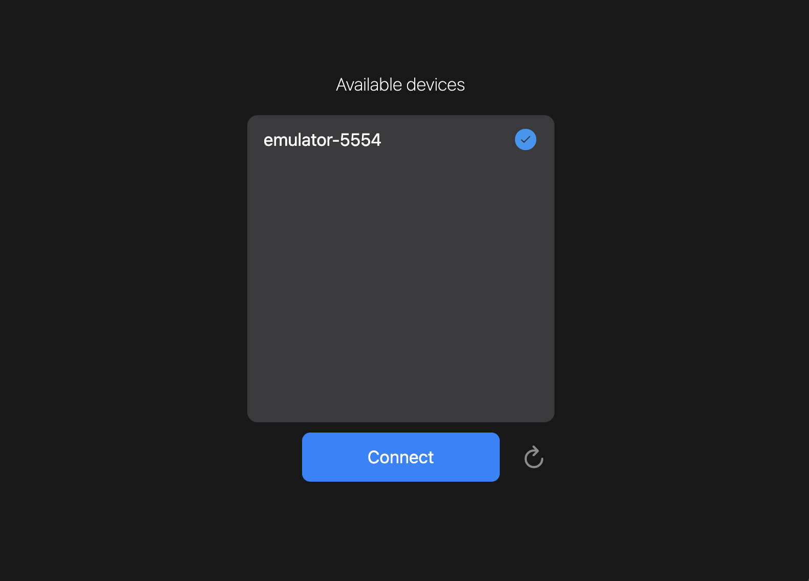
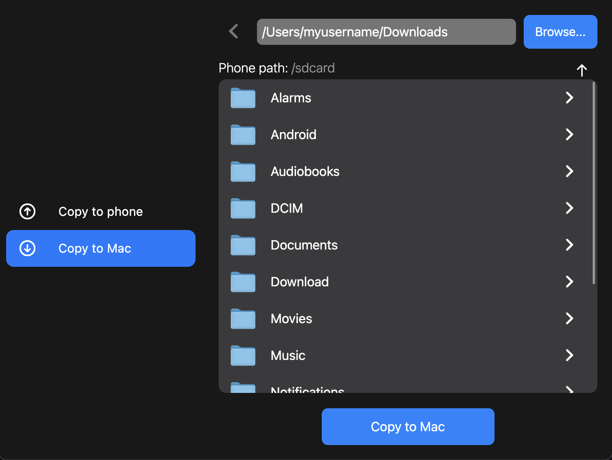

# Foldie

<p align="center">  

</p>

## Description

Utility to transfer files between your Android smartphone and Mac.

Written in Flutter, it uses [adb](https://developer.android.com/tools/adb) to find connected devices and transfer files with them.

## Installation

Install the latest version from the [Release](https://github.com/FLopriore/foldie/releases) section.

Otherwise, you can build it from source by running:

```
flutter build macos --release
```

## Usage

1. Make sure you've enabled **Developer Options** on your device. [Here](https://developer.android.com/studio/debug/dev-options#enable) is a guide.
2. Enable **Debug USB** as shown [here](https://developer.android.com/studio/debug/dev-options#Enable-debugging). Steps n. 1-2 must be done only once.
3. Connect your smartphone to the Mac and select "Transfer file/Android Auto" from the notification.
4. Now you are ready to use the app.

## Screenshots




